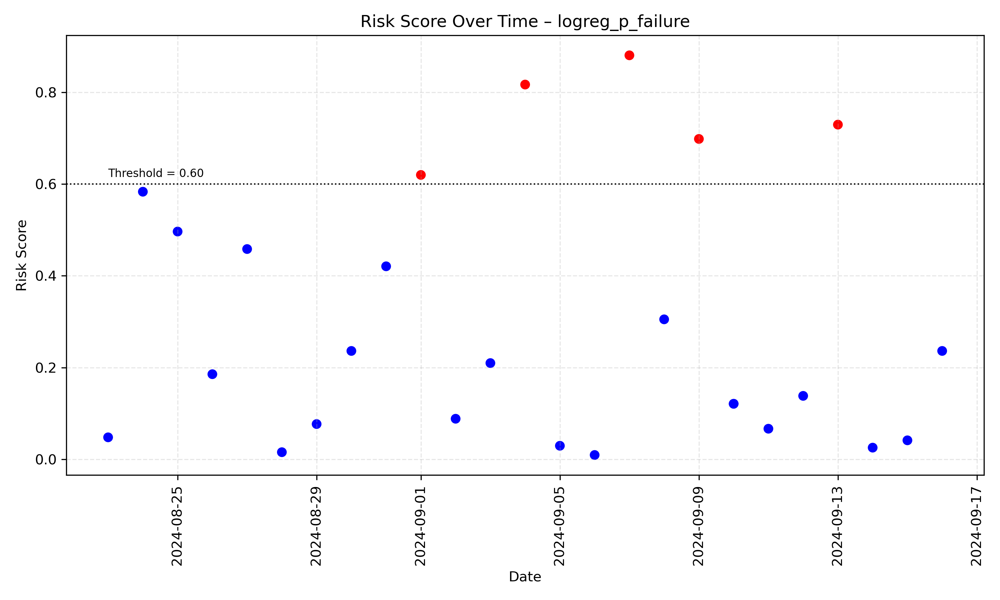

# Batch Risk Scoring Tool – Case Study

This Python tool uses both unsupervised (GMM) and supervised (logistic regression) models to estimate the risk of batch failure based on historical process data — before final QC results are available. It is designed to mimic early-warning risk assessments commonly used in process development, MSAT, and systems integration roles.

---

## Use Case

This tool is intended for scenarios where an engineer or scientist needs to:
- Estimate the likelihood that a batch will fail QC, based solely on process inputs and inline data
- Enable real-time decision-making in the absence of delayed lab results
- Visualize batch-level risk scores over time to detect trends or drift
- Classify batches using parameter-space clustering (GMM) or a probability model (logreg)

Built for workflows such as:
- Cell therapy viability prediction (biotech)
- Bioreactor health scoring based on inputs like pH or DO
- Semiconductor tool matching using in-line signal parameters
- Any environment where QC is slow, but early triage matters

---

## How to Run

1. Install dependencies:
   ```bash
   pip install -r requirements.txt
   ```

2. Set your working directory:
   ```python
   # In predict_new_batch_risks.py or risk_model_gmm.py
   base_dir = r'C:\path\to\your\batch_summary_tool'
   ```

3. Run model training (GMM and logreg):
   ```bash
   python risk_logic_generator.py
   ```

4. Run risk prediction on new test batches:
   ```bash
   python predict_new_batch_risks.py
   ```

---

## Features

- Fits Gaussian Mixture Model (GMM) clusters to identify low-viability regions in parameter space
- Trains logistic regression classifier to predict P(failure) from labeled training data
- Saves `.pkl` model files and cluster maps for downstream use
- Applies both models to new, unlabeled batch data
- Flags batches using a configurable `risk_threshold`
- Generates visual time-series plots for decision support

---

## Why This Project?

This tool reflects the kind of lightweight decision support system a senior process engineer or staff MSAT lead might prototype to improve upstream visibility in a fast-moving production environment.

It demonstrates:
- Awareness of real-world bottlenecks like QC lag time and inline variability
- A systems-level approach to parameter-space clustering and risk modeling
- Thoughtful use of model utility across early- vs. late-stage decision making
- Clear, reproducible Python code that another engineer could trust and extend

The goal is not to replace enterprise LIMS systems, but to show initiative in identifying gaps and building adaptable tooling to reduce delay between processing and insight — a key leadership lever in early-phase manufacturing or tech transfer teams.

---

## Example Dataset

The example files simulate:
- Batch metadata (`component_A`, `avg_pH`, `supplier_lot`)
- Final QC viability outcomes used for training
- A new set of batches without QC results to simulate inline-only inference

This mirrors how an engineer might construct and validate a triage tool for early screening of high-risk batches while waiting for lab turnaround.

---

## Model Comparison: Parameter Space


---

## Risk Trend Over Time (LogReg)



---

## Future Enhancements

- Add integration with real-time process historians or MES
- Build a Streamlit dashboard for visual batch reviews
- Add model drift detection using incoming QC data
- Incorporate additional process features or engineered parameters

---
