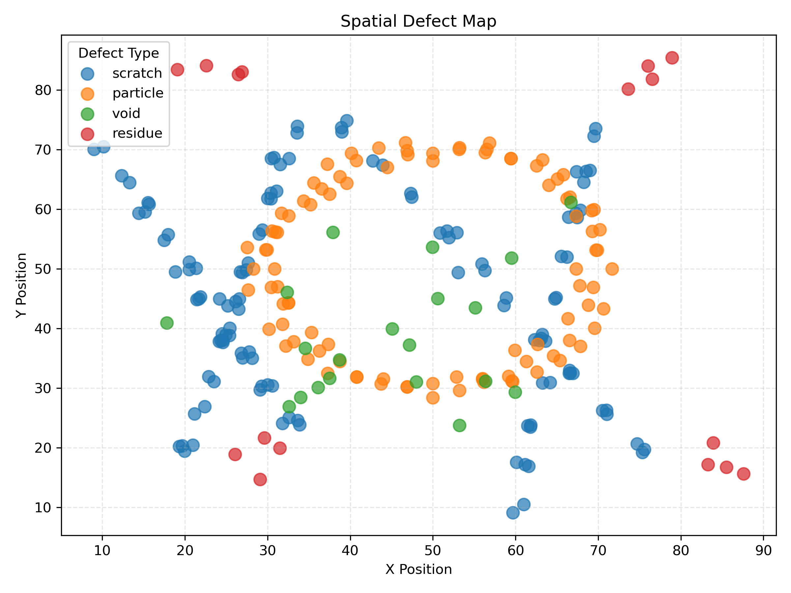

# Spatial Defect Map Tool – Case Study

This Python tool visualizes spatial defect patterns from CSV input data. It generates a 2D scatter map of defect locations, color-coded by defect type, and saves a high-resolution PNG output. The goal is to simulate real-world failure analysis (FA), debug, or early-stage triage workflows for process or manufacturing engineers.

---

## Use Case

This script is ideal for scenarios where a process engineer, integration engineer, or yield analyst needs to:
- Visualize spatial distributions of known defect types
- Detect morphology patterns such as scratches or contamination arcs
- Generate consistent defect maps for communication or triage

Designed to reflect real-world scenarios such as:
- Wafer-level scratch, residue, or particle maps (semiconductor)
- Microarray or biochip surface contamination (biotech/life sciences)
- Flat panel manufacturing defects or printhead alignment noise

---

## How to Run

1. Install requirements:
   pip install -r requirements.txt

2. Update the input_csv and output_png in spatial_defect_map_runner.py:
   - **If using Windows**, use a raw string format for the file path:  
   input_csv = r'C:\Users\yourname\yourdata.csv'
   output_png = 'spatial_defect_map.png'

3. Run the script:
   python spatial_defect_map_runner.py

4. Outputs will be saved in the same folder as the script:
   - spatial_defect_map.png — 2D defect map by type and position

---

## Features

- 2D defect plotting with color-coded markers
- Support for defect type and severity attributes
- Modular code structure with reusable functions
- MATLAB-to-Python transition comments included
- Portable, script-relative file paths
- Realistic sample dataset with visual morphology

---

## Why This Project?

As an engineer with experience in data visualization and process development, I built this tool to demonstrate:
- Practical spatial awareness in failure/debug workflows
- Ability to simulate and communicate real-world defect types
- Readable, modular Python scripting aligned with engineering use cases
- Fluency with defect visualization outside of black-box tools

This tool is not intended to replace full MES defect analytics platforms, but to showcase thoughtful problem-solving and engineering tool design for early-stage teams or internal debug support.

---

## Example Dataset

The included example_defects.csv simulates:
- Realistic scratch streaks with tight radial spread
- A donut-shaped cluster of particle contamination
- Off-center residue smears
- Random but clustered voids

This reflects common failure signatures observed in early-stage yield learning or ramp qualification.

---

## Spatial Map Preview

---

## Future Enhancements

- Add filtering by severity or defect type
- Overlay wafer edge boundary for reference
- Include defect count summaries or heatmap binning
