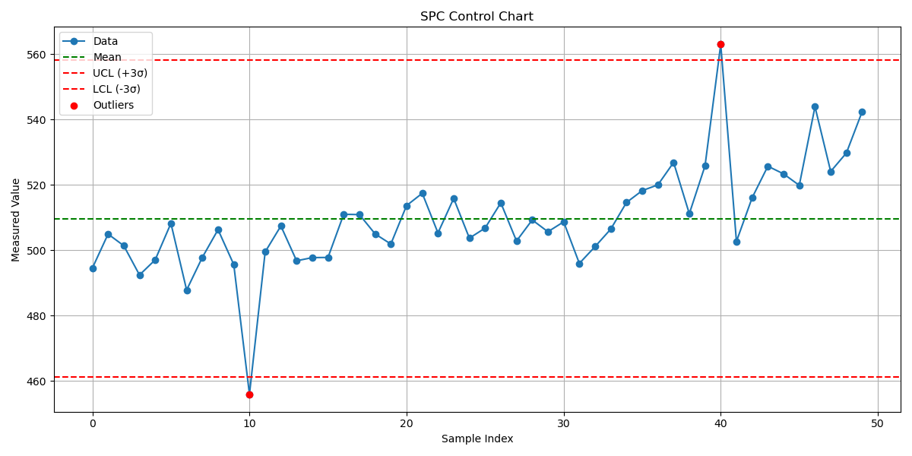

# SPC Summary Tool – Case Study

This Python tool performs basic statistical process control (SPC) analysis on numeric manufacturing or lab process data. It loads a CSV or Excel file, calculates control limits, flags outliers, and saves a control chart and annotated output file — all in a clean, reproducible, and modular way.

---

## Use Case

This script is ideal for scenarios where a process engineer, MSAT scientist, or systems integrator needs to:
- Quickly evaluate in-line data for drift, instability, or outliers
- Flag batches for investigation
- Generate visual SPC outputs with minimal manual handling

Designed to reflect real-world manufacturing scenarios such as:
- Wafer-level thickness or film uniformity (semiconductor)
- Assay yield, cell viability, or bioreactor pH (biotech/pharma)
- Any process metric tracked over time or batch

---

## How to Run

1. Install requirements:
   pip install -r requirements.txt

2. Update the file_path and value_column in spc_runner.py:
   - **If using Windows**, use a raw string format for the file path: 
   file_path = r'C:\Users\yourname\yourdata.csv'
   value_column = 'Thickness_nm'

3. Run the script:
   python spc_runner.py

4. Outputs will be saved in the same folder as the script:
   - output_chart.png — Control chart with UCL, LCL, mean, and flagged outliers
   - flagged_data.csv — Data with outlier column added

---

## Features

- Summary statistics: mean, std, min, max, UCL/LCL
- Z-score or IQR-based outlier detection
- Control chart generation with matplotlib
- Self-contained outputs saved next to script
- Human-readable code with educational comments
- MATLAB-to-Python transitions explained in code

---

## Why This Project?

As an engineer with a background in process development and system-level thinking, I built this tool to demonstrate:
- Clean, production-aware scripting
- Modular, maintainable Python workflows
- Thoughtful integration of statistical analysis with real-world application
- Ability to build tools that others can use, modify, and trust

This tool is not intended to replace enterprise-scale SPC platforms, but to show that I understand how statistical control systems work and can design lightweight, engineer-friendly solutions — especially valuable in fast-growing or early-stage environments.

---

## Example Dataset

The included example_data_with_drift.csv simulates:
- A stable process phase
- A gradual drift in the mean
- Increased variability
- Injected outliers

This reflects the kind of signal an engineer might use SPC tools to detect before yield drops or a failure occurs.

---

## SPC Chart Preview

---

## Future Enhancements

- Add command-line interface (CLI) for dynamic inputs
- Integrate Western Electric rules
- Automate monitoring on live process feeds

---